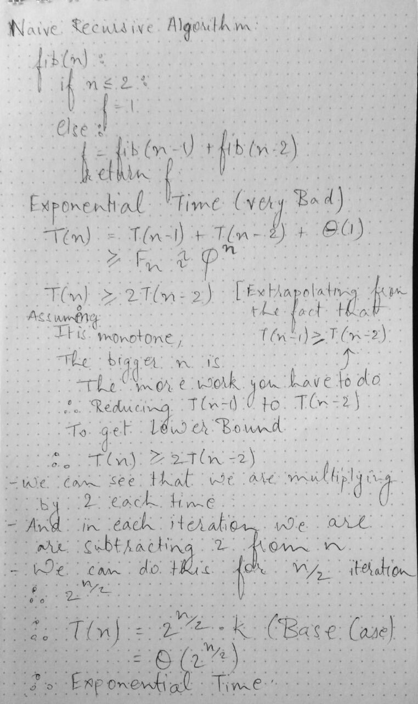

# Dynamic Programming
- careful **brute-force**
- Lecture contents 
    1. memoization and subproblems
    2. Fibonacci
    3. shortest paths
    4. guessing and DAG view
- **spiel** = long or fast speech or story, typically one intended as a means of persuasion or as an excuse but regarded with skepticism or contempt by those who hear it.
synonymns: speech, patter, sales pitch, blurb, talk
- optimization in american english is the same as prgramming in british algorithm
- dynamic programming invented by Richard Bellman algorithm ("Bellman Ford" algorithm fame)
- he invented the word dynamic programming to hide the fact that he was doing mathematical research because working under a secretary who hated the word "research"
- he settled for the word dynamic programming because it would be difficult to give a pejorative meaning to it and something that not even a congressman could object to
- basically it sounded "cool"
- How to compute fibonacci numbers 
- acronymns for dynamic programming :
    - "careful brute force"
    - "subproblems + reuse"
    - take a problem, split it into subproblems, solve those subproblems and then reuse those subproblems
1. Fibonacci
    - F1 = F2 = 1
    - Fn = Fn-1 + Fn-2
    - goal : compute Fn
    - Algorithm

        ```
            fib(n):
                if n <= 2:
                    f = 1
                else:
                    f = fib(n-1) + fib(n-2)
                return f
        ```
    - 